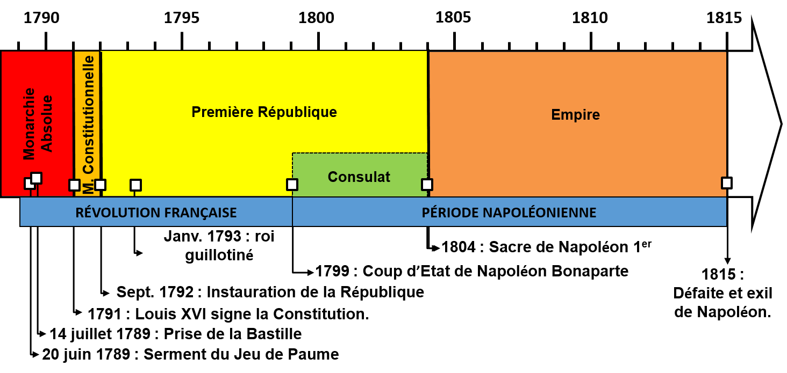

# Time modeling

A dating is the positioning of an ***event*** or ***duration*** on a timeline correlatively to the positioning of another event or duration. A dating makes it possible to say *this happened before*, or *this happened after*, or *this happened during*. Important difficulties can come from the uncertainty of the dating (*date* ± *delta*) and the need of class interval for comparison (First Republic, Empire, etc.). To manage this uncertainty, statistics are required (randomization, confidence intervals, bayesian modeling, etc.)   
  
## Notions and operators

Classical operators of time modeling are those coming from the temporal logic (Linear Temporal Logic, Interval Temporal Logic, etc.). When the *starting* and *ending* events are known -- for example, 1870 to 1940 AD for the French Third Republic -- maybe one the most interesting model is the [Allen's interval algebra](https://en.wikipedia.org/wiki/Allen%27s_interval_algebra) where events are discrete 0-dimension features modeled with `POINTS`, and duration are continuous 1-dimension features modeled with `LINES` (more precisely: segments). 

  

## Absolute *or* relative dating ?

Whether a partition between absolute and relative dating can be done, different techniques form an in-between. **Age-depth models**, often used by paleo-environmentalists, and **seriation** are relative chronology fixed to an absolute reference timeline with a sample of known absolute chronological events. The **cross-dating** is the same but instead of absolute chronological events, the reference grid is a reference series (*master series*). Cross-dating can mix absolute and relative dating.

### Absolute dating
>  "*On a small geographical scale, within a short period of time, there are large differences in the ceramics*" (A. Hafner) 

Difficulties of absolute dating interpretation depends on the accuracy of the dating: the more precise the dating of an event is, the more important it is to understand its temporal significance.  
  
For example, a radiocarbon date coming from a Late Mesolithic/Early Neolithic cave can cover a span of ~ 100 years and *only* reflecting the replacement of a cultural entity (Last hunters-gatherers) by another (Early farmers). At the opposite, a tree ring post coming from an Bronze Age stilt house can be dated to the year -- sometimes to the season -- and reflect the sub-sub-phase of a larger event (the house building).

#### Radiocarbon and dendrochronological data integration and visualization

Radiocarbon (14C) and dendrochronological dates are one of the most sharable world-wide data. Their integration in online database, their management, and their modeling represent a classic playground in computing archaeology. R programming offers different tools to manage these data, we present a [short interactive review](https://neolithic.shinyapps.io/AbsoluteDating/) of R based computer solutions

#### **NeoNet** Neolithisation of the central and western Mediterranean
>  by Thomas Huet and [Niccolo Mazzuco](nicco.mazzucco@gmail.com) 

We started to develop a RShiny app for interactive selection, mapping and calibration for the Mesolithic/Neolithic transition in Central and Western Mediterranean, the [NeoNet app](https://neolithic.shinyapps.io/NeoNet2/)

  
The NeoNet webpage explains [how to use](https://zoometh.github.io/C14/neonet) this app. The canvas of this RShiny app allows to use another database: the [Euroevol database](http://discovery.ucl.ac.uk/1469811/), and to create the [EUROEVOL_R app](https://neolithic.shinyapps.io/Euroevol_R/)  

### Relative dating

Relative dating is another name for chronological sequences. Relative dating reflects the fact that some events are known to be more ancient, or more recent, or contemporaneous to other events. In archaeology, the **stratigraphy** is the main method to infer relative chronology between cultural layers. Nicholas Steno has established its theoretical principles. The main ones are:

* **principle of original horizontality**: the oldest layers are underneath
* **original unit of deposits**: one layer = one geological event

