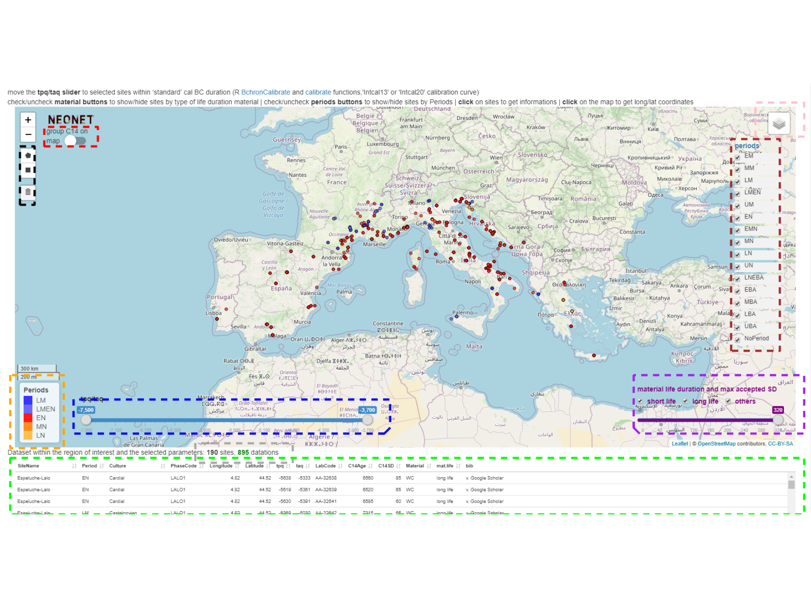
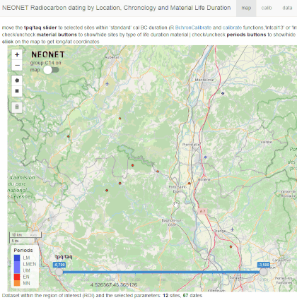
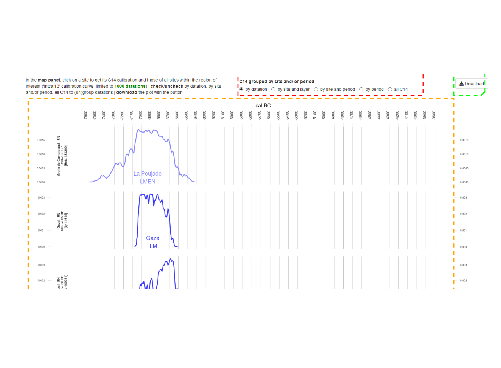

<style>
.html-widget {
    margin: auto;
}
</style>


<style type="text/css">
caption {
      color: grey;
      # font-weight: bold;
      # font-size:small; # not working (15px, large)
    }
</style>

<div class="figure" style="text-align: center">

```{=html}
<div id="htmlwidget-2bb8ad83cfd50984ada2" style="width:60%;height:400px;" class="leaflet html-widget"></div>
<script type="application/json" data-for="htmlwidget-2bb8ad83cfd50984ada2">{"x":{"options":{"crs":{"crsClass":"L.CRS.EPSG3857","code":null,"proj4def":null,"projectedBounds":null,"options":{}}},"calls":[{"method":"addTiles","args":["//{s}.tile.openstreetmap.org/{z}/{x}/{y}.png",null,"OSM",{"minZoom":0,"maxZoom":18,"tileSize":256,"subdomains":"abc","errorTileUrl":"","tms":false,"noWrap":false,"zoomOffset":0,"zoomReverse":false,"opacity":1,"zIndex":1,"detectRetina":false,"attribution":"&copy; <a href=\"http://openstreetmap.org\">OpenStreetMap<\/a> contributors, <a href=\"http://creativecommons.org/licenses/by-sa/2.0/\">CC-BY-SA<\/a>"}]},{"method":"addCircleMarkers","args":[[45.7833,45.78,45.6833,45.62,45.62,45.354,45.354,45.354,45.209,45.209,45.209,45.209,45.209,45.209,45.209,45.209,45.209,45.209,45.209,45.209,45.209,45.209,45.209,45.209,45.209,45.209,45.209,45.209,45.209,45.209,45.209,45.209,45.19,45.08,45.0461,44.89,44.89,44.87,44.74,44.7,44.7,44.52,44.52,44.52,44.52,44.45,44.4,44.343,44.32,44.32,44.32,44.32,44.32,44.32,44.32,44.32,44.32,44.32,44.303,44.27,44.27,44.27,44.27,44.27,44.27,44.27,44.27,44.27,44.27,44.27,44.27,44.27,44.27,44.27,44.27,44.27,44.27,44.27,44.27,44.25,44.25,44.25,44.25,44.25,44.25,44.25,44.17,44.13,44.12,44.12,44.12,44.12,44.12,44.12,44.092609,44.092609,44.092609,44.092609,44.092609,44.092609,44.092609,44.092609,44.01,44.01,43.9544,43.9,43.9,43.89,43.88,43.88,43.88,43.810304,43.810304,43.806724,43.806724,43.806724,43.806724,43.806724,43.806724,43.806724,43.806724,43.806724,43.806724,43.806724,43.806724,43.806724,43.806724,43.806724,43.806724,43.806724,43.806724,43.806724,43.806724,43.806724,43.806724,43.806724,43.806724,43.806724,43.806724,43.806724,43.806724,43.806724,43.806724,43.806724,43.806724,43.806724,43.806724,43.806724,43.806724,43.806724,43.806724,43.76,43.685,43.685,43.685,43.685,43.636852,43.636852,43.636852,43.636852,43.636852,43.59501,43.59501,43.59501,43.59501,43.59501,43.59501,43.59501,43.59501,43.59501,43.59501,43.59501,43.58,43.58,43.58,43.58,43.58,43.58,43.58,43.58,43.58,43.58,43.58,43.58,43.58,43.58,43.58,43.58,43.58,43.58,43.58,43.58,43.58,43.58,43.5147,43.49,43.49,43.49,43.49,43.49,43.49,43.49,43.49,43.49,43.49,43.49,43.49,43.49,43.47,43.38,43.38,43.38,43.38,43.38,43.38,43.38,43.38,43.38,43.38,43.38,43.38,43.38,43.38,43.38,43.38,43.38,43.38,43.38,43.38,43.38,43.38,43.38,43.38,43.38,43.38,43.38,43.38,43.38,43.38,43.38,43.38,43.38,43.38,43.38,43.38,43.38,43.38,43.38,43.38,43.38,43.38,43.38,43.38,43.38,43.33,43.31,43.31,43.31,43.31,43.31,43.31,43.31,43.31,43.31,43.31,43.31,43.31,43.31,43.31,43.3,43.3,43.3,43.3,43.3,43.3,43.3,43.3,43.3,43.3,43.3,43.3,43.3,43.3,43.3,43.3,43.3,43.29,43.29,43.29,43.29,43.29,43.29,43.29,43.29,43.29,43.29,43.29,43.29,43.29,43.29,43.29,43.29,43.29,43.29,43.29,43.29,43.29,43.29,43.29,43.29,43.29,43.29,43.29,43.29,43.29,43.29,43.29,43.29,43.29,43.29,43.29,43.29,43.25,43.15,43.15,43.15,43.15,43.075,43.075,43.075,43.075,43.075,43.075,42.83,42.83,42.83,42.83,42.83,42.83,42.83,42.83,42.83,42.83,42.78,42.78,42.78,42.78,42.78,42.78,42.78,42.78,42.72,42.72,42.626,42.626,42.48,42.4509735107422,42.44,42.44,42.1045370204646,41.5539660389688,41.5539660389688,41.5539660389688,41.4147751551063],[3.08333,4.8,5.35,6.01,6.01,5.886,5.886,5.886,5.633,5.633,5.633,5.633,5.633,5.633,5.633,5.633,5.633,5.633,5.633,5.633,5.633,5.633,5.633,5.633,5.633,5.633,5.633,5.633,5.633,5.633,5.633,5.633,5.49,5.39,3.86606,5.37,5.37,4.08,1.83,1.72,1.72,4.82,4.82,4.82,4.82,4.42,4.22,4.753,4.47,4.47,4.47,4.47,4.47,4.47,4.47,4.47,4.47,4.47,4.568,4.42,4.42,4.42,4.42,4.42,4.42,4.42,4.42,4.42,4.42,4.42,4.42,4.42,4.42,4.42,4.42,4.42,4.69,4.69,4.69,4.37,4.37,4.37,4.37,4.37,4.37,4.37,3.17,5.96,3.18,3.18,3.18,3.18,3.18,3.18,4.852488,4.852488,4.852488,4.852488,4.852488,4.852488,4.852488,4.852488,5.17,5.17,3.1962,3.73,3.73,6.23,5.66,5.66,5.66,4.336482,4.336482,7.497243,7.497243,7.497243,7.497243,7.497243,7.497243,7.497243,7.497243,7.497243,7.497243,7.497243,7.497243,7.497243,7.497243,7.497243,7.497243,7.497243,7.497243,7.497243,7.497243,7.497243,7.497243,7.497243,7.497243,7.497243,7.497243,7.497243,7.497243,7.497243,7.497243,7.497243,7.497243,7.497243,7.497243,7.497243,7.497243,7.497243,7.497243,6.15,6.824,6.824,6.824,6.824,5.63962,5.63962,5.63962,5.63962,5.63962,7.00635,7.00635,7.00635,7.00635,7.00635,7.00635,7.00635,7.00635,7.00635,7.00635,7.00635,6.215,6.215,6.215,6.215,6.215,6.215,6.215,6.215,6.215,3.36,3.36,6.215,6.215,6.215,6.215,6.215,6.215,6.215,6.215,6.215,6.215,6.215,3.27,2.89,2.89,2.89,2.89,2.89,2.89,2.89,2.89,2.89,2.89,2.89,2.89,2.89,6.52,5.16,5.16,5.16,5.16,5.16,5.16,5.16,5.16,5.16,5.16,5.16,5.16,5.16,5.16,5.16,5.16,5.16,5.16,5.16,5.16,5.16,5.16,5.16,5.16,5.16,5.16,5.16,5.16,5.16,5.16,5.16,5.16,5.16,5.16,5.16,5.16,5.16,5.16,5.16,5.16,5.16,5.16,5.16,5.16,5.16,2.6,3.35,3.35,3.35,3.35,3.35,3.33,3.33,3.33,3.33,3.33,3.33,3.35,3.35,3.35,2.34,2.34,2.34,2.34,2.34,2.34,2.34,2.34,2.34,2.34,2.34,2.34,2.34,2.34,2.34,2.34,2.34,2.4,2.4,2.4,2.4,2.4,2.4,2.4,2.4,2.4,2.4,2.4,2.4,2.4,2.4,2.4,2.4,2.4,2.4,2.4,2.4,2.4,2.4,2.4,2.4,2.4,2.4,2.4,2.4,2.4,2.4,2.4,2.4,2.4,2.4,2.4,2.4,2.71,1.18333,1.18333,1.18333,1.18333,2.475,2.475,2.475,2.475,2.475,2.475,3.01,3.01,3.01,3.01,3.01,3.01,3.01,3.01,3.01,3.01,2.08,2.08,2.08,2.08,2.08,2.08,2.08,2.08,2.62,2.62,2.949,2.949,2.65,8.66902828216558,2.34,2.34,9.40806311236511,8.95112472043439,8.95112472043439,8.95112472043439,9.16223487449845],3,["Ly-7625","OxA-19858","Ly-386","KIA-7476","Ly-8054","Ly-7092","Ly-7096 ","Ly-8635 ","Ly-176","Ly-5185","Beta-255118","GrA-25066","Ly-11552 (SacA-39069)","Ly-11554 (SacA-39071)","Ly-11555 (SacA-39072)","Ly-11557 (SacA-39059)","Ly-11726 (SacA-39760)","Ly-11727 (SacA-39761)","Beta-282246","Beta-282247","Ly-11551 (SacA-39068)","Ly-11553 (SacA-39070)","Ly-11556 (SacA-39073)","GrA-50236","Ly-5099","Ly-7352 (SacA-20970)","Ly-9370 (SacA-30348)","Ly-9369 (SacA-30347)","Ly-9371 (SacA-30349)","Beta-255119","Ly-4446","Ly-4447","Ly-7094","Ly-3043","Ly-3710","Ly-799","Ly-800","Ly-616","GSY-36A","Ly-33 (OxA-4551)","Ly-7791","AA-32638","AA-32639","AA-32641","AA-32642","Ly-423","Gif-7352","Ly-3958","ETH-27973","ETH-27972","ETH-27974","AA-53291","AA-53292","AA-53293","AA-53294","AA-53296","ETH-27975","MC-2034","MC-2376","Ly-304","Beta-253163","Beta-253158","Beta-253162","Beta-253164","Beta-253161","MC-730","Ly-494","Ly-495","Ly-496","KN-1180","KN-1181","Ly-303","MC-694","MC-695","MC-728","MC-729","Beta-103862","Beta-103867","Beta-103868","Beta-433203","Beta-433202","Beta-433201","Beta-433200","Beta-433199","MC-1251","MC-563","Gif-446","Gif-8479","MC-1239","MC-1367","MC-2187","MC-2188","MC-2251","MC-2371","Ly-100 (OxA)","Ly-252 (OxA)","Ly-4725","Ly-4726 (OxA)","Ly-4727 (OxA) ","Ly-4728 (OxA) ","Ly-99 (OxA)","Gif-1855","_C11","Gif-1796","Gif-7688","MC-1290","MC-1291","Gif-8930","MC-263","MC-264","MC-265","Erl-9579","Erl-9580","GrA-29403","GrA-29528","LTL-15940A","LTL-8005A","LTL-8006A","GrA-26893","GrA-26894","GrA-32061","LTL-13787A","LTL-13788A","GrA-32944","LTL-14104A","LTL-8009A","GrA-26895","GrA-26897","LTL-8002A","LTL-8003A","LTL-8004A","LTL-8007A","LTL-8008A","LTL-8010A","LTL-8011A","LTL-8012A","LTL-8001A","LTL-15941A","LTL-15942A","Ly-1713 (GrA-20195)","GrA-29401","GrA-29402","Gif-A101334","Ly-5339","Ly-5690","Ly-5691","Ly-5692","GrA-23532","GrA-23533","Gif-6471","Gif-101340","Gif-1111","Ly-4156 (SacA-7413)","Ly-4157 (SacA-7414)","Ly-3331","Ly-3332","ETH-27978","ETH-27980","ETH-27979","ETH-27981","ETH-26417","LTL-12317A","LTL-13780A","LTL-8479A","LTL-8483A","LTL-8484A","LTL-12315A","LTL-12316A","LTL-13784A","LTL-18523A","LTL-8482A","LTL-15033A","Ly-3748","_Sep-H1 mix","_Sep-H3 mix","GrA-38329","GrA-38332","GrA-38334","GrA-38335","GrA-38336","GrA-38522","Ly-538","MC-794","Ly-4376","Ly-6490","Gif-2756","Gif-2757","Gif-2988","Gif-2989","Gif-2990","Ly-4373","Ly-4374","Ly-6491","Ly-6492","MC-1227","Beta-433206","Beta-433207","Beta-433209","Beta-433211","Beta-433208","Beta-433204","Beta-433205","Gif-3077","Gif-1488","Gif-1489","Gif-1490","Gif-1491","Gif-3078","Gif-8656","Beta-267434","LTL-15416A","LTL-15419A","Ly-622","Ly-623","MC-531T","LTL-15785A","KN-1182","KN-1399","KN-1449","LTL-15782A","LTL-15786A","LTL-15949A","LTL-15784A","LTL-15950A","LTL-15951A","LTL-15780A","LTL-15781A","LTL-15783A","LTL-15948A","Kn-1208","Ly-2824","Ly-2825","Ly-2826","Ly-2827","Ly-2828","Ly-2829","Ly-2830","Ly-2831","Ly-2832","Ly-2833","Ly-438","Ly-446","Ly-447","Ly-448","Ly-624","MC-2514","MC-2515","MC-2516","MC-531A","MC-531L","MC-532","MC-533","MC-941","MC-942","MC-2145","Beta-398950","Beta-398951","Beta-398952","Ly-9878","Ly-9879 (SacA-32046)","Ly-5688","Ly-5689","Ly-8399","Ly-8400","MC-1652","Ly-245","Ly-245 (OxA)","Ly-7222","Ly-7607","Beta-398972","Beta-398971","Beta-398975","Beta-398976","Beta-398970","Beta-398973","Beta-398974","Beta-398977","Gif-7024","Gif-7026","Gif-7029","Ly-4770","Ly-4771","Ly-4773","MC-497","MC-498","MC-499","Beta-398934","Beta-398936","Beta-398937","Beta-398944","Beta-398945","Beta-398946","Beta-398947","Beta-469930","Beta-469931","KN-Sm","Gif-2401","GrN-6702","GrN-6703","GrN-6704","GrN-6705","GrN-6706","GrN-6707","KN-1265","KN-1266","Ly-11332","Ly-11333","Ly-11334","Ly-11335","Ly-11336","Ly-11337","Ly-11338","Ly-11339","Ly-11340","Ly-1992","Ly-1993","Ly-1994","Ly-2241","Ly-2242","Ly-2243","Ly-2244","Ly-2245","Ly-5702","Gif-5497","Ly-1089","Ly-1090 (OxA) ","Ly-6814","Beta-398981","Beta-398983","MC-935","Gif-3575","MC-785","MC-786","Beta-398931","Beta-398929","Beta-398932","Beta-398933","Beta-398927","Beta-398928","Beta-398930","Gif-2747","Gif-2749","MC-788","MC-1100","MC-1102","MC-1103","MC-1104","MC-1105","MC-1107","MC-780","MC-781","Ly-3302","Ly-5104","GrA-16273","Ly-10069","Gif-1709","Ly-6085","Ly-267","Ly-226","MC-2243","Ly-8327","Ly-8328","Ly-9519","LgQ-617"],null,{"interactive":true,"className":"","stroke":true,"color":"#03F","weight":1,"opacity":0.7,"fill":true,"fillColor":"#03F","fillOpacity":0.7},null,null,["Pontcharaud","Boul.Periph. Nord de Lyon","Alfort","Le Creux des Elaphes","Le Creux des Elaphes","Aulp du Seuil","Aulp du Seuil","Aulp du Seuil","La Grande Rivoire","La Grande Rivoire","La Grande Rivoire","La Grande Rivoire","La Grande Rivoire","La Grande Rivoire","La Grande Rivoire","La Grande Rivoire","La Grande Rivoire","La Grande Rivoire","La Grande Rivoire","La Grande Rivoire","La Grande Rivoire","La Grande Rivoire","La Grande Rivoire","La Grande Rivoire","La Grande Rivoire","La Grande Rivoire","La Grande Rivoire","La Grande Rivoire","La Grande Rivoire","La Grande Rivoire","La Grande Rivoire","La Grande Rivoire","Pas de Lechelle","Balme Rousse","Espaly Saint Marcel","Vassieux en Vercors","Vassieux en Vercors","Longetraye","Roucadour","Le Sanglier Grotte","Le Sanglier Grotte","Espeluche-Lalo","Espeluche-Lalo","Espeluche-Lalo","Espeluche-Lalo","Combe Obscure","La Tardive","Saint Paul Trois Chateaux","Baume d'Oullins","Baume d'Oullins","Baume d'Oullins","Baume d'Oullins","Baume d'Oullins","Baume d'Oullins","Baume d'Oullins","Baume d'Oullins","Baume d'Oullins","Baume d'Oullins","Saint Marcel d'Ardeche, Bidon","Baume de Montclus","Baume de Montclus","Baume de Montclus","Baume de Montclus","Baume de Montclus","Baume de Montclus","Baume de Montclus","Baume de Montclus","Baume de Montclus","Baume de Montclus","Baume de Montclus","Baume de Montclus","Baume de Montclus","Baume de Montclus","Baume de Montclus","Baume de Montclus","Baume de Montclus","Petites-Baties","Petites-Baties","Petites-Baties","Aigle (Grotte de l')","Aigle (Grotte de l')","Aigle (Grotte de l')","Aigle (Grotte de l')","Aigle (Grotte de l')","Aigle (Grotte de l')","Aigle (Grotte de l')","Combe Greze","Frigouras","La Poujade","La Poujade","La Poujade","La Poujade","La Poujade","La Poujade","Le Baratin","Le Baratin","Le Baratin","Le Baratin","Le Baratin","Le Baratin","Le Baratin","Le Baratin","Grotte d'Unang","Grotte d'Unang","Roc Troue","Grotte de l'Abbe Pialat","Grotte de l'Abbe Pialat","Ravin De Mouresse Boline","Saint Mitre: Abri 3","Saint Mitre: Abri 3","Saint Mitre: Abri 3","Mas de Vignoles X","Mas de Vignoles X","Pendimoun","Pendimoun","Pendimoun","Pendimoun","Pendimoun","Pendimoun","Pendimoun","Pendimoun","Pendimoun","Pendimoun","Pendimoun","Pendimoun","Pendimoun","Pendimoun","Pendimoun","Pendimoun","Pendimoun","Pendimoun","Pendimoun","Pendimoun","Pendimoun","Pendimoun","Pendimoun","Pendimoun","Pendimoun","Pendimoun","Pendimoun","Pendimoun","Pendimoun","Pendimoun","Pendimoun","Pendimoun","Pendimoun","Pendimoun","Pendimoun","Pendimoun","Pendimoun","Pendimoun","Abri du Capitaine","Lombard","Lombard","Lombard","Lombard","Mourre de la Barque","Mourre de la Barque","Mourre de la Barque","Mourre de la Barque","Mourre de la Barque","Les Breguieres","Les Breguieres","Les Breguieres","Les Breguieres","Les Breguieres","Les Breguieres","Les Breguieres","Les Breguieres","Les Breguieres","Les Breguieres","Les Breguieres","Fontbregoua","Fontbregoua","Fontbregoua","Fontbregoua","Fontbregoua","Fontbregoua","Fontbregoua","Fontbregoua","Fontbregoua","Baume de Bourbon","Baume de Bourbon","Fontbregoua","Fontbregoua","Fontbregoua","Fontbregoua","Fontbregoua","Fontbregoua","Fontbregoua","Fontbregoua","Fontbregoua","Fontbregoua","Fontbregoua","La Resclauze","Camprafaud","Camprafaud","Camprafaud","Camprafaud","Camprafaud","Camprafaud","Camprafaud","Camprafaud","Camprafaud","Camprafaud","Camprafaud","Camprafaud","Camprafaud","Colle Rousse","Font-des-Pigeons","Font-des-Pigeons","Font-des-Pigeons","Font-des-Pigeons","Font-des-Pigeons","Font-des-Pigeons","Font-des-Pigeons","Font-des-Pigeons","Font-des-Pigeons","Font-des-Pigeons","Font-des-Pigeons","Font-des-Pigeons","Font-des-Pigeons","Font-des-Pigeons","Font-des-Pigeons","Font-des-Pigeons","Font-des-Pigeons","Font-des-Pigeons","Font-des-Pigeons","Font-des-Pigeons","Font-des-Pigeons","Font-des-Pigeons","Font-des-Pigeons","Font-des-Pigeons","Font-des-Pigeons","Font-des-Pigeons","Font-des-Pigeons","Font-des-Pigeons","Font-des-Pigeons","Font-des-Pigeons","Font-des-Pigeons","Font-des-Pigeons","Font-des-Pigeons","Font-des-Pigeons","Font-des-Pigeons","Font-des-Pigeons","Font-des-Pigeons","Font-des-Pigeons","Font-des-Pigeons","Font-des-Pigeons","Font-des-Pigeons","Font-des-Pigeons","Font-des-Pigeons","Font-des-Pigeons","Font-des-Pigeons","Balma de Labeurador","Pont de Roque-Haute","Pont de Roque-Haute","Pont de Roque-Haute","Pont de Roque-Haute","Pont de Roque-Haute","Peiro Signado","Peiro Signado","Peiro Signado","Peiro Signado","Peiro Signado","Pont de Roque-Haute","Pont de Roque-Haute","Pont de Roque-Haute","Pont de Roque-Haute","Font-Juvenal","Font-Juvenal","Font-Juvenal","Font-Juvenal","Font-Juvenal","Font-Juvenal","Font-Juvenal","Font-Juvenal","Font-Juvenal","Font-Juvenal","Font-Juvenal","Font-Juvenal","Font-Juvenal","Font-Juvenal","Font-Juvenal","Font-Juvenal","Font-Juvenal","Gazel","Gazel","Gazel","Gazel","Gazel","Gazel","Gazel","Gazel","Gazel","Gazel","Gazel","Gazel","Gazel","Gazel","Gazel","Gazel","Gazel","Gazel","Gazel","Gazel","Gazel","Gazel","Gazel","Gazel","Gazel","Gazel","Gazel","Gazel","Gazel","Gazel","Gazel","Gazel","Gazel","Gazel","Gazel","Gazel","l'Horte","Abri du Buholoup","Abri du Buholoup","Abri du Buholoup","Abri du Buholoup","Abri Jean Cros","Abri Jean Cros","Abri Jean Cros","Abri Jean Cros","Abri Jean Cros","Abri Jean Cros","Correge-Leucate","Correge-Leucate","Correge-Leucate","Correge-Leucate","Correge-Leucate","Correge-Leucate","Correge-Leucate","Correge-Leucate","Correge-Leucate","Correge-Leucate","Dourgne","Dourgne","Dourgne","Dourgne","Dourgne","Dourgne","Dourgne","Dourgne","Cauna de Belesta","Cauna de Belesta","Aspres del Paradis","Aspres del Paradis","Montbolo","A Revellata","Camp del Ginebre","Camp del Ginebre","Casabianda","Renaghju","Renaghju","Renaghju","Longone"],null,null,{"interactive":false,"permanent":false,"direction":"auto","opacity":1,"offset":[0,0],"textsize":"10px","textOnly":false,"className":"","sticky":true},null]}],"limits":{"lat":[41.4147751551063,45.7833],"lng":[1.18333,9.40806311236511]}},"evals":[],"jsHooks":[]}</script>
```

<p class="caption">(\#fig:preview)Preview of the current [NeoNet dataset](#panel.data) (work in progress) using RShiny and Leaflet in R</p>
</div>


<!-- The NeoNet app is part of the [Time modeling project](https://github.com/zoometh/C14#time-modeling) -->


# **Presentation**

The [**NeoNet app**](https://neolithic.shinyapps.io/NeoNet2/) aims to contribute to the study the pioneering front of the farming live-style (i.e., Neolithic) by focusing our study on the mobile border between the Last Hunter-Gathers economy and the Early Neolithic (ca. 7000 BC to 3500 BC) in the Central and Western Mediterranean. The interactive web app facilitates the selection of absolute dates (c14 dates) by providing selection tools for:

* spatial
  + geographical region of interest (ROI)
  + custom selection shape inside the ROI
  
* chronology 
  + date time span between a *tpq* and a *taq* in cal BC
  + main periods (Middle Mesolithic, Late Mesolithic, Early Neolithic, ...)
  
* date accuracy
  + some type of material life duration (short like, long life or others)
  + threshold of the maximum accepted standard deviation (SD)

 <!-- and more precisely the Mediterranean watersheds of this area -->

<!-- <p style="text-align: center;"> -->
<!-- /Documents/C14/docs/imgs/ws_roi.png){width=35%} -->
<!-- </p> -->

The app has been developed in the frame of the [NeoNet work group](https://redneonet.com). We will see [how it works](#app), what is the format [dataset](#bd) and what are our [objectives](#particip)

# **NeoNet app** {#app}

The app is a [RShiny](https://shiny.rstudio.com/) hosted on the [**shinyapps.io**](https://www.shinyapps.io/) server. The app is divided into five (5) panels:

1. [**map** panel](#panel.map): spatial filtering with selection menus on dates
2. [**calib** panel](#panel.calib): calibration of the selected dates
3. [**data** panel](#panel.data): the whole dataset
4. [**biblio** panel](#panel.biblio): bibliographical references
5. [**infos** panel](#panel.infos): credits and link to the webpage handbook of the app

## 1. **map** panel {#panel.map}
/Documents/C14/docs/imgs/panel_map_idx.png){width=20%}
 
The panel **map** is a geographical window provided by the [Leaflet](https://rstudio.github.io/leaflet/) package. This panel is used for selection of radiocarbon dates [by location](#panel.map.select.loc), [by chronology](#panel.map.select.chr), [by quality of dates](#panel.map.select.quali). Once selected, dates can be [calibrated](#panel.map.calib)


<div class="figure" style="text-align: center">

<p class="caption">(\#fig:panel-map1)The different menus of the map panel</p>
</div>
  
The current functions are:

* Fig. \@ref(fig:panel-map1), <span style="color:red"><u>red</u></span> box, top-left button ***group C14 on map***: allows to cluster dates by spatial proximities ([Marker Clusters](http://rstudio.github.io/leaflet/markers.html)) 

* Fig. \@ref(fig:panel-map1), <span style="color:pink"><u>pink</u></span> box, top-right layer button: allows to change the basemap. By default, the basemap is **OSM**, an [OpenStreetMap general basemap](https://leaflet-extras.github.io/leaflet-providers/preview/#filter=OpenStreetMap.Mapnik), but it can be switch to **Topo**, an [ESRI topographical basemap](https://leaflet-extras.github.io/leaflet-providers/preview/#filter=Esri.WorldImagery)

* Fig. \@ref(fig:panel-map1), <span style="color:darkgrey"><u>grey</u></span> box, bottom inline text: reactive count of selected dates and select sites 

* Fig. \@ref(fig:panel-map1), <span style="color:green"><u>green</u></span> box, bottom table: reactive datatable ([DT package](https://cran.r-project.org/web/packages/DT/index.html)) listing all the dates within the map extent (ROI) and the optional selection menus (tpq/taq, material life duration, maximum SD, periods, selection shapes)

### select by location {#panel.map.select.loc}

By default only the data within the window extent (ROI) will be selected. But selection shapes can be drawn inside this ROI to have a spatial intersection:
  
Fig. \@ref(fig:panel-map1), <span style="color:black"><u>black</u></span> box, top-left draw toolbar: selection shapes, ***polygons*** and ***rectanges***, can *freeze* the date selection inside a given ROI. They can be removed with the trash button. All the dates inside the ROI and selected with the others filters will be visible on the map, but only those inside the selections shapes will be calibrated  

<center>

/Documents/C14/docs/imgs/panel_map_shape.png){width=700px}

</center>

#### retrieve coordinates from the map {#panel.map.select.loc.get}

As said, the default basemap of the app is OSM. It offers a well documented basemap where archaeological sites are sometimes already located, like the Ligurian site of [Grotta della Pollera](https://www.openstreetmap.org/#map=19/44.20058/8.31466). Clicking on the map show the lat/long coordinates of the current point (under the tpq/tap slider). These coordinates can then be copied and used to modify the NeoNet dataset

<center>

/Documents/C14/docs/imgs/panel_map_coords.png){width=250px}

</center>

### select by chronology {#panel.map.select.chr}

* Fig. \@ref(fig:panel-map1), <span style="color:brown"><u>brown</u></span> box, top-right checkboxes: allow to select dating by periods. The <span style="color:orange"><u>orange</u></span> box, bottom-left legend, is reactive and update depending on selected periods

* Fig. \@ref(fig:panel-map1), <span style="color:blue"><u>blue</u></span> box, bottom-left slider: allows to subset a range of accepted dates between a *tpq* and a *taq* (in cal BC)

### select by dates quality {#panel.map.select.quali}

* Fig. \@ref(fig:panel-map1), <span style="color:purple">purple</span> box, bottom-right checkboxes and slider: a group of menus for selection on the material life duration and max accepted SD:
  + relatively to the duration of their material (short to long-life material)
  + below a maximum accepted threshold for the standard deviations (SD) for the dates

### calibrate one or various dates {#panel.map.calib}

The dates displayed in the [table of the **map panel**](#panel.map) will be calibrate when one of them has been clicked.

<center>

/Documents/C14/docs/imgs/panel_map_select.png){width=250px}

</center>


## 2. **calib** panel {#panel.calib}
/Documents/C14/docs/imgs/panel_calib_idx.png){width=20%}


The panel **calib** is used for analysis. Calibration of selected dates are done on-the-fly with the R packages [Bchron](https://cran.r-project.org/web/packages/Bchron/index.html) and [rcarbon](https://cran.r-project.org/web/packages/rcarbon/index.html). If the dates are numerous (e.g., > 100) the computing time could take times.

<center>



</center>

This date which have been clicked on the [**map panel**](#panel.map.calib) will be shown **bolded** on the output figure

### c14 group by *filter* {#panel.calib.group}

The only selection which can be done is on the top-center radio button  (Fig. \@ref(fig:panel-calib), <span style="color:red"><u>red</u></span> box). The **c14 group by** filter allows to plot dates and to sum their probability densities depending on different levels of grouping:

* **by date**: each date is plot separately (by default)

* **by PhaseCode**: dates from the same site, having the same archaeological unit (layer, structure, etc.), are summed. See the [PhaseCode](#mf.phasecode) field.

* **by site and period**: dates from the same site, having the same period are summed

* **by period**: dates having the same period are summed  

* **all C14**: all dates are summed 

<div class="figure" style="text-align: center">

<p class="caption">(\#fig:panel-calib)The different menus of the calib panel</p>
</div>

### plot area *output*

The plot area (Fig. \@ref(fig:panel-calib), <span style="color:orange"><u>orange</u></span> box) shows dynamically the SPD of the cabibrated dates seriated on their weighted means. The top-right  button **Download** (Fig. \@ref(fig:panel-calib), <span style="color:green"><u>green</u></span> box) allows to export the last plot in a PNG image

<p style="text-align: center;">
/Documents/C14/docs/imgs/neonet_calib_example.png){width=80%}
</p>

## 3. **data** panel {#panel.data}
/Documents/C14/docs/imgs/panel_data_idx.png){width=20%}

The complete dataset from the GitHub  [c14data.tsv](https://github.com/zoometh/C14/blob/main/neonet/c14data.tsv) file (a dataframe with tab-separated values). Today, the dataset counts <span style="color: grey;">364</span> dates:

<table class="table" style="font-size: 11px; width: auto !important; margin-left: auto; margin-right: auto;">
<caption style="font-size: initial !important;">(\#tab:panel-data)Dates sample</caption>
 <thead>
  <tr>
   <th style="text-align:left;">   </th>
   <th style="text-align:left;"> Country </th>
   <th style="text-align:right;"> Latitude </th>
   <th style="text-align:right;"> Longitude </th>
   <th style="text-align:left;"> SiteName </th>
   <th style="text-align:left;"> Period </th>
   <th style="text-align:left;"> PhaseCode </th>
   <th style="text-align:left;"> LabCode </th>
   <th style="text-align:right;"> C14BP </th>
   <th style="text-align:right;"> C14SD </th>
   <th style="text-align:left;"> Material </th>
   <th style="text-align:left;"> MaterialSpecies </th>
   <th style="text-align:left;"> bib </th>
   <th style="text-align:left;"> bib_url </th>
  </tr>
 </thead>
<tbody>
  <tr>
   <td style="text-align:left;"> 300 </td>
   <td style="text-align:left;"> France </td>
   <td style="text-align:right;"> 43.29000 </td>
   <td style="text-align:right;"> 2.400000 </td>
   <td style="text-align:left;"> Gazel </td>
   <td style="text-align:left;"> LM </td>
   <td style="text-align:left;"> Porche F6 </td>
   <td style="text-align:left;"> GrN-6704 </td>
   <td style="text-align:right;"> 7880 </td>
   <td style="text-align:right;"> 75 </td>
   <td style="text-align:left;"> WC </td>
   <td style="text-align:left;"> Wood charcoal (unidentified) </td>
   <td style="text-align:left;"> Barbazza et al. 1984 </td>
   <td style="text-align:left;"> Barbaza84 </td>
  </tr>
  <tr>
   <td style="text-align:left;"> 185 </td>
   <td style="text-align:left;"> France </td>
   <td style="text-align:right;"> 43.58000 </td>
   <td style="text-align:right;"> 6.215000 </td>
   <td style="text-align:left;"> Fontbregoua </td>
   <td style="text-align:left;"> EN </td>
   <td style="text-align:left;"> n/a </td>
   <td style="text-align:left;"> Ly-6490 </td>
   <td style="text-align:right;"> 6280 </td>
   <td style="text-align:right;"> 85 </td>
   <td style="text-align:left;"> WC </td>
   <td style="text-align:left;"> n/a </td>
   <td style="text-align:left;"> Binder 1995 </td>
   <td style="text-align:left;"> Binder95 </td>
  </tr>
  <tr>
   <td style="text-align:left;"> 132 </td>
   <td style="text-align:left;"> France </td>
   <td style="text-align:right;"> 43.80672 </td>
   <td style="text-align:right;"> 7.497243 </td>
   <td style="text-align:left;"> Pendimoun </td>
   <td style="text-align:left;"> EN </td>
   <td style="text-align:left;"> US 19001 </td>
   <td style="text-align:left;"> LTL-8007A </td>
   <td style="text-align:right;"> 6170 </td>
   <td style="text-align:right;"> 45 </td>
   <td style="text-align:left;"> SE </td>
   <td style="text-align:left;"> Quercus sp. charred seeds </td>
   <td style="text-align:left;"> Binder et al. 2018 </td>
   <td style="text-align:left;"> 10.4312/dp.44.4 </td>
  </tr>
  <tr>
   <td style="text-align:left;"> 208 </td>
   <td style="text-align:left;"> France </td>
   <td style="text-align:right;"> 43.49000 </td>
   <td style="text-align:right;"> 2.890000 </td>
   <td style="text-align:left;"> Camprafaud </td>
   <td style="text-align:left;"> EN </td>
   <td style="text-align:left;"> C19 </td>
   <td style="text-align:left;"> Gif-3078 </td>
   <td style="text-align:right;"> 6480 </td>
   <td style="text-align:right;"> 130 </td>
   <td style="text-align:left;"> WC </td>
   <td style="text-align:left;"> Wood charcoal (unidentified) </td>
   <td style="text-align:left;"> Rodriguez 1984 </td>
   <td style="text-align:left;"> Rodriguez84 </td>
  </tr>
</tbody>
</table>

At first, these data are recorded in a Excel spreadsheet (c14 spreadsheet) in order to facilitate their editing (filter, sorting, fill). Then a R function read this spreadsheet, calculate the *tpq* and *taq* (in BC) of each unCal BP (with [Bchron](https://cran.r-project.org/web/packages/Bchron/index.html)),  and convert it into a .tsv file. As data came from various publications, an homogenization the different values (material, cultures, bibliographical references, etc.) must be done. Currently, special characters (`é`, `à`, etc.) are not accepted. The dataset **mandatory fields** are:

* **SiteName**: the site name
* [coordinates (two fields)](#mf.coords)  
  + **Longitude**: in decimal degrees (ex: `1.0451`)
  + **Latitude**: in decimal degrees (ex: `43.9213`)
* **Period**: a value from the [**period.abrev**](#bd.period) spreadsheet
* [**PhaseCode**](#mf.phasecode): a code for the dating stratigaphical unit and/or structure
* **C14Age**: a numerical radiocarbon dating in BP
* **C14SD**: the standard deviation (SD) of the radiocarbon dating
* [**LabCode**](#mf.labcode): the unique identifier of the radiocarbon dating
* **Material**: a value from the [**material.life**](#bd.material) spreadsheet 
* **MaterialSpecies**: a specification of the field **Material**
* **tpq**: the *terminus post quem* of the radiocarbon dating in cal BC
* **taq**: the *terminus ante quem* of the radiocarbon dating in cal BC
* [bibliographical references (two fields)](#mf.bib_all)
  + [**bib**](#mf.bib): a short plain text bibliographical reference
  + [**bib_url**](#mf.bib_url): a DOI or a BibTeX key bibliographical reference

The **recommended** fields are:

* **Culture**: a specification of the field **Period**

The others fields (if there's any) only concern the **[EUROEVOL_R app](https://zoometh.github.io/C14)** 

#### mandatory fields

Here we explain more precisely some of the mandatory fields

##### **Longitude** and **Latitude** {#mf.coords}

In in decimal degrees and a precision of four (4) decimal digits (ex: `1.0453, 43.9211`). Since the modeling is supra-regional, the app does not need to record dates with high accuracy geographical coordinates. At the minimum, this accuracy can be a location inside the departmental/county boundaries ([how to retrieve better coordinates from the map](#panel.map.select.loc.get))

##### **PhaseCode** {#mf.phasecode}

The PhaseCode field provide a more precise archaeological context than the site name. It is useful for [**layer/structure C14 grouping**](#panel.calib.group). Most of the time, it correspond to an archaeological layer or structure

<table class="table" style="font-size: 12px; width: auto !important; margin-left: auto; margin-right: auto;">
 <thead>
  <tr>
   <th style="text-align:left;"> PhaseCode </th>
  </tr>
 </thead>
<tbody>
  <tr>
   <td style="text-align:left;"> C5 </td>
  </tr>
  <tr>
   <td style="text-align:left;"> C7-8 </td>
  </tr>
  <tr>
   <td style="text-align:left;"> foyer 7 </td>
  </tr>
  <tr>
   <td style="text-align:left;"> niv. II </td>
  </tr>
  <tr>
   <td style="text-align:left;"> ... </td>
  </tr>
</tbody>
</table>

Values of this field need to be homogeneized (for example: `C.5` or `layer 5` -> `C5`) -- at first for the same sites, in order to group them -- then for the whole dataset. The `n/a` value (i.e., not available) is reserved to dates without intra-site contextual information

##### **LabCode** {#mf.labcode}

LabCode (i.e., laboratory code) should be unique. Their conventional syntax is '*AbrevLab*-*number*', respecting the case letters (upper case and lower case). For example:

<table class="table" style="font-size: 12px; width: auto !important; margin-left: auto; margin-right: auto;">
 <thead>
  <tr>
   <th style="text-align:left;"> LabCode </th>
  </tr>
 </thead>
<tbody>
  <tr>
   <td style="text-align:left;"> Beta-103487 </td>
  </tr>
  <tr>
   <td style="text-align:left;"> CSIC-1133 </td>
  </tr>
  <tr>
   <td style="text-align:left;"> ETH-15984 </td>
  </tr>
  <tr>
   <td style="text-align:left;"> Gif-1855 </td>
  </tr>
  <tr>
   <td style="text-align:left;"> GrN-6706 </td>
  </tr>
  <tr>
   <td style="text-align:left;"> KIA-21356 </td>
  </tr>
  <tr>
   <td style="text-align:left;"> LTL-13440A </td>
  </tr>
  <tr>
   <td style="text-align:left;"> Ly-11338 </td>
  </tr>
  <tr>
   <td style="text-align:left;"> MC-2145 </td>
  </tr>
  <tr>
   <td style="text-align:left;"> OxA-9217 </td>
  </tr>
  <tr>
   <td style="text-align:left;"> Poz-18393 </td>
  </tr>
  <tr>
   <td style="text-align:left;"> ... </td>
  </tr>
</tbody>
</table>

See also the [list of laboratories](http://radiocarbon.webhost.uits.arizona.edu/node/11). Exceptionally, if a date has no LabCode -- e.g., the 'Sep-H3 mix' from Fontbregoua, 6082 +/- 35 BP -- the convention is to use the PhaseCode (e.g., 'Sep-H3 mix') with an underscore as a prefix (e.g., '_Sep-H3 mix') to get an unique key.

##### **bib** and **bib_url** {#mf.bib_all}

Every radiocarbon date should be referenced with a bibliographical reference with a plain text in the [**bib**](#mf.bib) field and and a DOI or a BibTex key in the [**bib_url**](#mf.bib_url) field. We favor the earliest mention of the radiocarbon date. 

###### **bib** {#mf.bib}

The plain text that will be plot for each radiocarbon date under the bibliographical reference section. Basically the name of the author(s) and the publication year, for example `Guilaine et al. 1993`, `Binder 2018` or `Manen et Sabatier 2013`. The values of this field can be the same for two different publications (e.g. `Delibrias et al. 1982` refers to two different publications the same year) 

###### **bib_url** {#mf.bib_url}

Either a DOI (starting with "`10`") or a unique BibTeX key. We favor the DOI as a unique bibliographical reference. The values of this field should be unique for a single publication (e.g. the BibTeX keys `Delibrias82` and `Delibrias82a`). For example: 

<table class="table" style="font-size: 12px; width: auto !important; margin-left: auto; margin-right: auto;">
 <thead>
  <tr>
   <th style="text-align:left;"> tpq </th>
   <th style="text-align:left;"> taq </th>
   <th style="text-align:left;"> select </th>
   <th style="text-align:left;"> RedNeo </th>
   <th style="text-align:left;"> bib </th>
   <th style="text-align:left;"> bib_url </th>
  </tr>
 </thead>
<tbody>
  <tr>
   <td style="text-align:left;"> -6086 </td>
   <td style="text-align:left;"> -5923 </td>
   <td style="text-align:left;"> VRAI </td>
   <td style="text-align:left;"> 1 </td>
   <td style="text-align:left;"> Binder et al. 2018 </td>
   <td style="text-align:left;"> <b>https://doi.org/10.4312/dp.44.4</b> </td>
  </tr>
  <tr>
   <td style="text-align:left;"> ... </td>
   <td style="text-align:left;"> ... </td>
   <td style="text-align:left;"> ... </td>
   <td style="text-align:left;"> ... </td>
   <td style="text-align:left;"> ... </td>
   <td style="text-align:left;"> ... </td>
  </tr>
</tbody>
</table>

When the DOI is lacking, the bibliographical reference should be include into the BibTex document [references.bib](https://raw.githubusercontent.com/zoometh/C14/master/shinyapp/references_france.bib) with the name of the first author and the two last digits of the year:


```r
@book{Guilaine93,
  title={Dourgne: derniers chasseurs-collecteurs et premiers {\'e}leveurs de la Haute-Vall{\'e}e de l'Aude},
  author={Guilaine, Jean and Barbaza, Michel},
  year={1993},
  publisher={Centre d'anthropologie des soci{\'e}t{\'e}s rurales; Arch{\'e}ologie en Terre d'Aude}
}
```

The key of this reference is added to the **bib_url** field. For example, the key value **Guilaine93** from the c14 spreadsheet will match this complete reference 

<table class="table" style="font-size: 12px; width: auto !important; margin-left: auto; margin-right: auto;">
 <thead>
  <tr>
   <th style="text-align:left;"> tpq </th>
   <th style="text-align:left;"> taq </th>
   <th style="text-align:left;"> select </th>
   <th style="text-align:left;"> RedNeo </th>
   <th style="text-align:left;"> bib </th>
   <th style="text-align:left;"> bib_url </th>
  </tr>
 </thead>
<tbody>
  <tr>
   <td style="text-align:left;"> -3330 </td>
   <td style="text-align:left;"> -2492 </td>
   <td style="text-align:left;"> FAUX </td>
   <td style="text-align:left;"> 1 </td>
   <td style="text-align:left;"> Guilaine et al. 1993 </td>
   <td style="text-align:left;"> <b>Guilaine93</b> </td>
  </tr>
  <tr>
   <td style="text-align:left;"> ... </td>
   <td style="text-align:left;"> ... </td>
   <td style="text-align:left;"> ... </td>
   <td style="text-align:left;"> ... </td>
   <td style="text-align:left;"> ... </td>
   <td style="text-align:left;"> ... </td>
  </tr>
</tbody>
</table>

### correspondance tables

The NeoNet app makes joins to two tables in order to retrieve information and to provide a handy user interface

#### material.life {#bd.material}

Material life duration are read from the GitHub  [c14_material_life.tsv](https://github.com/zoometh/C14/blob/main/neonet/c14_material_life.tsv) file. The two fields show the material type (column 1) and the material life duration (column 2), for example: 

<table class="table" style="font-size: 12px; width: auto !important; margin-left: auto; margin-right: auto;">
 <thead>
  <tr>
   <th style="text-align:left;"> material.type </th>
   <th style="text-align:left;"> life.duration </th>
  </tr>
 </thead>
<tbody>
  <tr>
   <td style="text-align:left;"> Drusch - trilladura </td>
   <td style="text-align:left;"> long.life </td>
  </tr>
  <tr>
   <td style="text-align:left;"> Agla </td>
   <td style="text-align:left;"> long.life </td>
  </tr>
  <tr>
   <td style="text-align:left;"> Angiosperma </td>
   <td style="text-align:left;"> long.life </td>
  </tr>
  <tr>
   <td style="text-align:left;"> animal bone </td>
   <td style="text-align:left;"> short.life </td>
  </tr>
  <tr>
   <td style="text-align:left;"> animal hair </td>
   <td style="text-align:left;"> short.life </td>
  </tr>
  <tr>
   <td style="text-align:left;"> antler </td>
   <td style="text-align:left;"> short.life </td>
  </tr>
</tbody>
</table>

This thesaurus is used both by the NeoNet app and the EUROEVOL_R app. Specifically, the NeoNet uses these values:

<table class="table" style="font-size: 12px; width: auto !important; margin-left: auto; margin-right: auto;">
 <thead>
  <tr>
   <th style="text-align:left;"> material.type </th>
   <th style="text-align:left;"> description </th>
  </tr>
 </thead>
<tbody>
  <tr>
   <td style="text-align:left;"> CE </td>
   <td style="text-align:left;"> Cerealia </td>
  </tr>
  <tr>
   <td style="text-align:left;"> F </td>
   <td style="text-align:left;"> Fauna </td>
  </tr>
  <tr>
   <td style="text-align:left;"> H </td>
   <td style="text-align:left;"> Human </td>
  </tr>
  <tr>
   <td style="text-align:left;"> OR </td>
   <td style="text-align:left;"> Organic </td>
  </tr>
  <tr>
   <td style="text-align:left;"> SE </td>
   <td style="text-align:left;"> Seed </td>
  </tr>
  <tr>
   <td style="text-align:left;"> SH </td>
   <td style="text-align:left;"> Shell </td>
  </tr>
  <tr>
   <td style="text-align:left;"> WC </td>
   <td style="text-align:left;"> Wood charchoal </td>
  </tr>
</tbody>
</table>


#### period.abrev {#bd.period}

Periods and periods abbreviations are read from the GitHub  [c14_period_abrev.tsv](https://raw.githubusercontent.com/zoometh/C14/master/neonet/c14_period_abrev.tsv) file. The two fields show the period abbreviation (column 1) and the period full label (column 2), for example:

<table class="table" style="font-size: 12px; width: auto !important; margin-left: auto; margin-right: auto;">
 <thead>
  <tr>
   <th style="text-align:left;"> period.brev </th>
   <th style="text-align:left;"> period </th>
  </tr>
 </thead>
<tbody>
  <tr>
   <td style="text-align:left;"> EM </td>
   <td style="text-align:left;"> Early Mesolithic </td>
  </tr>
  <tr>
   <td style="text-align:left;"> MM </td>
   <td style="text-align:left;"> Middle Mesolithic </td>
  </tr>
  <tr>
   <td style="text-align:left;"> LM </td>
   <td style="text-align:left;"> Late Mesolithic </td>
  </tr>
  <tr>
   <td style="text-align:left;"> UM </td>
   <td style="text-align:left;"> Undefined Mesolithic </td>
  </tr>
  <tr>
   <td style="text-align:left;"> LMEN </td>
   <td style="text-align:left;"> Late Mesolithic/Early Neolithic </td>
  </tr>
  <tr>
   <td style="text-align:left;"> EN </td>
   <td style="text-align:left;"> Early Neolithic </td>
  </tr>
</tbody>
</table>


In the NeoNet app, this dataset is rendered with the ([DT package](https://cran.r-project.org/web/packages/DT/index.html)) allowing sorting and filtering tools

## 4. **biblio** panel {#panel.biblio}
/Documents/C14/docs/imgs/panel_biblio_idx.png){width=20%}

Bibliographical references from the GitHub [c14refs.tsv](https://github.com/zoometh/C14/blob/main/neonet/c14refs.tsv) file. If only exist a BibTeX key, and no DOI, this file results of the join between the *bib_url* field of the C14 spreadsheet and the *references.bib*. If the DOI exists, the full bibliographical reference is  file:

<table class="table" style="font-size: 12px; width: auto !important; margin-left: auto; margin-right: auto;">
<caption style="font-size: initial !important;">(\#tab:panel-biblio)Bibliographical references sample</caption>
 <thead>
  <tr>
   <th style="text-align:left;">   </th>
   <th style="text-align:left;"> short.ref </th>
   <th style="text-align:left;"> key.or.doi </th>
   <th style="text-align:left;"> long.ref </th>
  </tr>
 </thead>
<tbody>
  <tr>
   <td style="text-align:left;"> 10 </td>
   <td style="text-align:left;"> Evin et Bintz 2002 </td>
   <td style="text-align:left;"> Evin02 </td>
   <td style="text-align:left;"> Evin J, Bintz P (2002). “Événements bio-climatiques et peuplements du Tardiglaciaire au début de l'Holocène dans les Alpes du nord Françaises [Bio-climatic events and human settlements from the Lateglacial to the Holocene in the French Northern Alps].” _Quaternaire, vol. 13, n°3-4, 2002. Événements rapides, instabilités, changements culturels au Quaternaire._. ISSN 1142-2904, doi: 10.3406/quate.2002.1720 (URL: https://doi.org/10.3406/quate.2002.1720), &lt;URL: https://www.persee.fr/doc/quate_1142-2904_2002_num_13_3_1720&gt;. </td>
  </tr>
  <tr>
   <td style="text-align:left;"> 5 </td>
   <td style="text-align:left;"> Skeates 2015 </td>
   <td style="text-align:left;"> Skeates15 </td>
   <td style="text-align:left;"> Skeates R (2015). _Rethinking the North Italian Early Neolithic_. Taylor \&amp; Francis. </td>
  </tr>
  <tr>
   <td style="text-align:left;"> 46 </td>
   <td style="text-align:left;"> Binder et al. 2017 </td>
   <td style="text-align:left;"> 10.15184/aqy.2017.65 </td>
   <td style="text-align:left;"> 10.15184/aqy.2017.65 </td>
  </tr>
  <tr>
   <td style="text-align:left;"> 35 </td>
   <td style="text-align:left;"> Binder et al. 2018 </td>
   <td style="text-align:left;"> 10.4312/dp.44.4 </td>
   <td style="text-align:left;"> 10.4312/dp.44.4 </td>
  </tr>
</tbody>
</table>

In the NeoNet app, these bibliographical references are rendered in APA citation format (field `long.ref`) 

## 5. **infos** panel {#panel.infos}
/Documents/C14/docs/imgs/panel_infos_idx.png){width=20%}

Infos, credits and link to this webpage (https://zoometh.github.io/C14/neonet)

# **Collaborative work** and contacts {#particip}

To facilitate contributions and a [FAIR](https://www.go-fair.org/fair-principles/) use of the app and dataset, we plan to:

1. publish the **dataset** in an Open Data repository to get a DOI (ex: [Zenodo](https://zenodo.org/))
2. reference the **dataset**  in a data paper with the DOI (ex: [JOAD](https://openarchaeologydata.metajnl.com/))
  + create a connector with the [c14bazAAR getter function](https://github.com/ropensci/c14bazAAR#contributing)
3. host the **app** on an institutional web server
4. publish the **app** source code in an Open digital humanities paper (ex: [JOSS](https://joss.theoj.org/))

To be informed on the project development or to contribute, please contact:

* [NeoNet work group](https://redneonet.com)
  + Miriam Cubas <mcubas.morera@gmail.com>
  + Juan Francisco Gibaja <jfgibaja@imf.csic.es>
  + Millán Mozota Holgueras <millanm@imf.csic.es>
  + [..complete list..](https://redneonet.com/colaboradores/)
  
* data integration
  + Niccolò Mazzucco <nicco.mazzucco@gmail.com>  
  + Miriam Cubas <mcubas.morera@gmail.com>
  + Juan Francisco Gibaja <jfgibaja@imf.csic.es>
  + F. Xavier Oms <oms@ub.edu>
  + Thomas Huet <thomashuet7@gmail.com> 
  
* IT integration
  + Thomas Huet <thomashuet7@gmail.com> 
